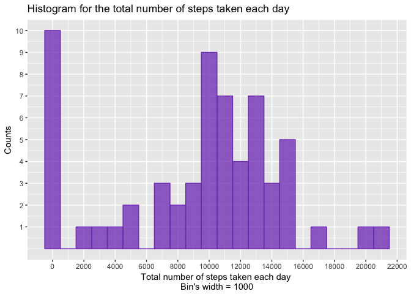
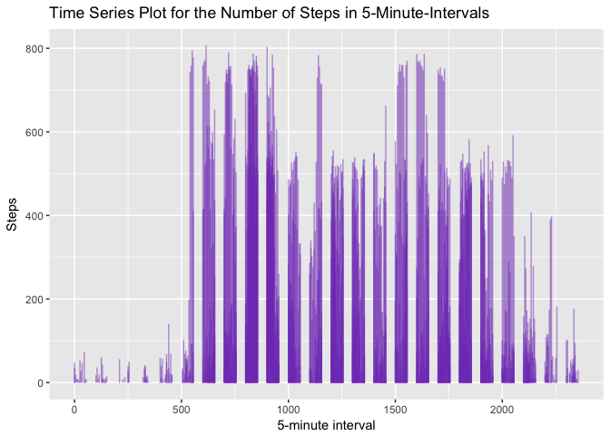
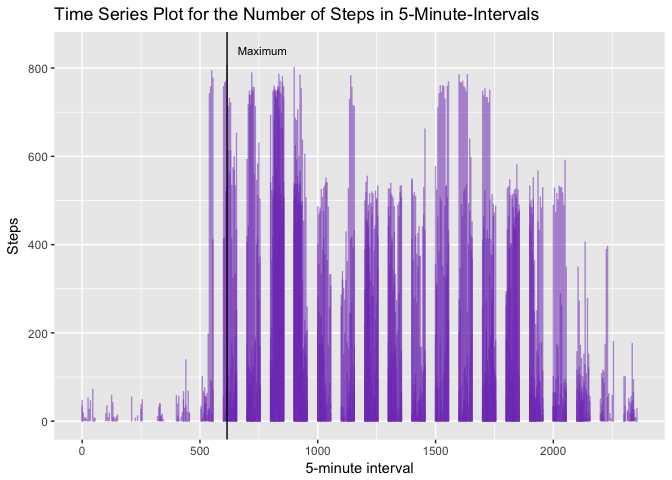
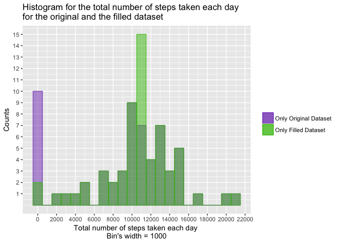
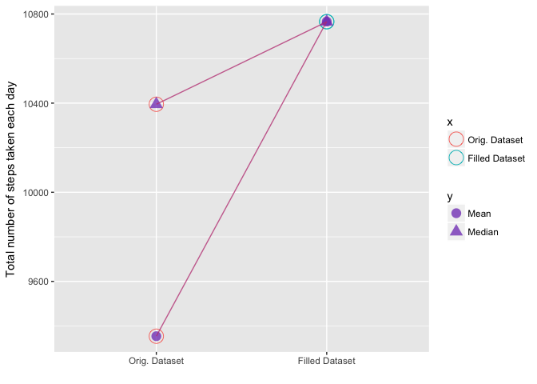
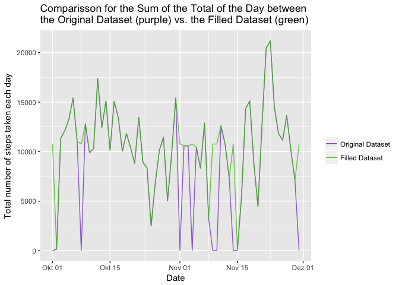
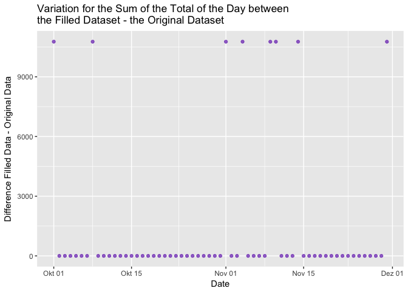
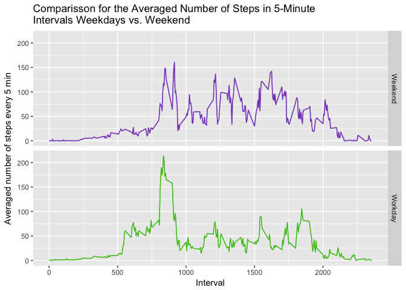

# Reproducible Research: Peer Assessment 1
Luis David Bedon Gomez  
4 Mai 2017  

## Introduction
The following report discuss the questions asked for the Course Project 1 of the reproducible Research Course of the Data Science Specialization from the Johns Hopkings University an Coursera, concearning the data about personal movement using activity monitoring devices.

## 1. Loading and preprocessing the data

### 1.1 Downloading and loading the data
The given data are stored in a zipped csv-File "activity.csv" and are loaded through the following routine:


```r
setwd("~/Coursera/ReproducibleResearch")
library(dplyr)
```

```
## 
## Attaching package: 'dplyr'
```

```
## The following objects are masked from 'package:stats':
## 
##     filter, lag
```

```
## The following objects are masked from 'package:base':
## 
##     intersect, setdiff, setequal, union
```

```r
library(ggplot2)

if(!file.exists("RepData_PeerAssessment1/activity.csv")){
  urldata<-"https://d396qusza40orc.cloudfront.net/repdata%2Fdata%2Factivity.zip"
  download.file(urldata,destfile = "activity.zip",method = "curl")
  unzip("activity.zip")
}

# NA-values are stored as "NA"
activity<-read.csv("activity.csv", stringsAsFactors = FALSE, na.strings = "NA")
```

### 1.2 Preprocessing the data

The loaded data were screened to understand the file using the following instruction:


```r
str(activity)
```

```
## 'data.frame':	17568 obs. of  3 variables:
##  $ steps   : int  NA NA NA NA NA NA NA NA NA NA ...
##  $ date    : chr  "2012-10-01" "2012-10-01" "2012-10-01" "2012-10-01" ...
##  $ interval: int  0 5 10 15 20 25 30 35 40 45 ...
```

Here we see the dimension of the file, the names of the columns, its classes and the content of the first rows.

The columns "steps" and "intervals"" are class "int", as we expect. Contrary, the column "date" is class "character" and we need it to be class "date". I will also
change the names of the columns by writing them with a capital letter.

The needed transformation goes as follows:


```r
activity$date<-as.Date(activity$date)
names(activity)<-c("Steps","Date","Interval")
class(activity$Date)
```

```
## [1] "Date"
```

```r
names(activity)
```

```
## [1] "Steps"    "Date"     "Interval"
```
And now the class of "activity$step" is "date" as needed.

## 2. What is mean total number of steps taken per day?

To address this question, I use a pipeline as follows:


```r
stepsperday<-activity %>% group_by(Date) %>% summarize(SumDay=sum(Steps,na.rm=1),MeanDay=round(mean(Steps,na.rm=1),1),MedianDay=median(Steps,na.rm=1))
print(stepsperday)
```

```
## # A tibble: 61 × 4
##          Date SumDay MeanDay MedianDay
##        <date>  <int>   <dbl>     <dbl>
## 1  2012-10-01      0     NaN        NA
## 2  2012-10-02    126     0.4         0
## 3  2012-10-03  11352    39.4         0
## 4  2012-10-04  12116    42.1         0
## 5  2012-10-05  13294    46.2         0
## 6  2012-10-06  15420    53.5         0
## 7  2012-10-07  11015    38.2         0
## 8  2012-10-08      0     NaN        NA
## 9  2012-10-09  12811    44.5         0
## 10 2012-10-10   9900    34.4         0
## # ... with 51 more rows
```

Here, i generate with Dyplr-pipeline in one line of code a variable "stepsperday" with the columns:

* "Date" for the date
* "SumDay" for the total number of steps per day
* "MeanDay" for the mean of steps per day and
* "MedianDay"for the median of steps per day.

### 2.1 Histogram of the total number of steps per day

With this data, I generate a histogram showing the number of counts for the total number of steps in 1000-intervals:


```r
ggplot()+
geom_histogram(data=stepsperday,aes(SumDay),binwidth=1000,colour=rgb(.5,.25,.75,1),fill=rgb(.5,.25,.75,.75))+
scale_x_continuous(name="Total number of steps taken each day \n Bin's width = 1000 ",breaks=seq(0,24000,2000),minor_breaks = seq(1000,24000,2000))+
scale_y_continuous(name="Counts",breaks=c(1,2,3,4,5,6,7,8,9,10))+
ggtitle("Histogram for the total number of steps taken each day")
```

<!-- -->

### 2.2 Mean and Median of the total number of steps per day

The Mean and Median of the total number of steps per day can be also calculated from the data frame "stepsperday" as follows:


```r
a1<-"The mean of total steps per day is:"
a2<-"The median of total steps per day is:"
paste(a1,round(mean(stepsperday$SumDay,na.rm = 1),0))
```

```
## [1] "The mean of total steps per day is: 9354"
```

```r
paste(a2,round(median(stepsperday$SumDay,na.rm = 1),0))
```

```
## [1] "The median of total steps per day is: 10395"
```

## 3. What is the average daily activity pattern?

### 3.1 Time Series Plot 

A diagramm presenting the averaged number of steps in 5-minutes-intervals over all days can be seen here:


```r
ggplot()+
geom_line(data=activity,aes(x=Interval,y=Steps),color=rgb(.5,.25,.75,.5))+
scale_x_continuous(name="5-minute interval")+ #,breaks=seq(0,24000,2000),minor_breaks = seq(1000,24000,2000))+
#scale_y_continuous(name="Number of steps",breaks=c(1,2,3,4,5,6,7,8,9,10))+
ggtitle("Time Series Plot for the Number of Steps in 5-Minute-Intervals")
```

```
## Warning: Removed 2 rows containing missing values (geom_path).
```

<!-- -->

### 3.2 Interval with the maximum number of steps

The interval with the maximal number of steps corresponds to:


```r
a3<-"The interval with the maximum number of steps corrensponds to number:"
maxsteps<-activity$Interval[grep(max(activity$Steps,na.rm=1),activity$Steps)]
paste(a3,maxsteps)
```

```
## [1] "The interval with the maximum number of steps corrensponds to number: 615"
```

The plot again, showing this interval:


```r
ggplot()+
geom_line(data=activity,aes(x=Interval,y=Steps),color=rgb(.5,.25,.75,.5))+
scale_x_continuous(name="5-minute interval")+ #,breaks=seq(0,24000,2000),minor_breaks = seq(1000,24000,2000))+
#scale_y_continuous(name="Number of steps",breaks=c(1,2,3,4,5,6,7,8,9,10))+
geom_vline(xintercept = maxsteps)+
annotate("text", x = maxsteps+150, y = 840, label = "Maximum",size = 3)+
ggtitle("Time Series Plot for the Number of Steps in 5-Minute-Intervals")
```

```
## Warning: Removed 2 rows containing missing values (geom_path).
```

<!-- -->


## 4. Imputing missing values


### 4.1 Total number of missing values 

The total number of missing values in rows in the dataset is:


```r
a4<-"The total number of missing values in rows in the dataset is:"
totalna<-table(complete.cases(activity))[1]
paste(a4,totalna)
```

```
## [1] "The total number of missing values in rows in the dataset is: 2304"
```

```r
a5<-"This corresponds to the following percentage of all cases: "
perc<-round(totalna/dim(activity),2)[1]*100
paste(a5,perc,"%",sep = "")
```

```
## [1] "This corresponds to the following percentage of all cases: 13%"
```

### 4.2 Strategy for filling in all of the missing values 

Regarding a strategy for filling all the missing values, I would try to fill missing values with the **mean of steps for all other days at the same time**.

This goes as follows:


```r
# function to find the intervals at the same time the other days
# using the operation "x mod y" x%%y and regarding that a day has
# 24*60/5=288 intervals of 5 minutes. Output a vector with the indices
# for the data with the same day
finditv <- function(z) seq(z%%(288-1),dim(activity)[1],24*60/5)+1

# function to calculate the mean of activity$Steps for the same days:
calcmean <- function(z) mean(activity$Steps[finditv(z-1)],na.rm=1)
 
# copy new dataset activityfilled, select NA and substitute them
activityfilled<-activity

for(i in 1:dim(activityfilled)[1]){

  if(is.na(activityfilled$Steps[i])==TRUE){
   
  activityfilled$Steps[i] <- calcmean(i)
  #print(i)
  }
}
```

### 4.3 New dataset with the missing data filled in

As in point 2., I calculate the sum, mean and median per day with the Dyplr-pipeline:


```r
stepsperdayfilled<-activityfilled %>% group_by(Date) %>% summarize(SumDay=sum(Steps,na.rm=1),MeanDay=round(mean(Steps,na.rm=1),1),MedianDay=median(Steps,na.rm=1))
print(stepsperdayfilled)
```

```
## # A tibble: 61 × 4
##          Date   SumDay MeanDay MedianDay
##        <date>    <dbl>   <dbl>     <dbl>
## 1  2012-10-01 10766.83    37.4  34.11321
## 2  2012-10-02   126.00     0.4   0.00000
## 3  2012-10-03 11352.00    39.4   0.00000
## 4  2012-10-04 12116.00    42.1   0.00000
## 5  2012-10-05 13294.00    46.2   0.00000
## 6  2012-10-06 15420.00    53.5   0.00000
## 7  2012-10-07 11015.00    38.2   0.00000
## 8  2012-10-08 10765.98    37.4  34.11321
## 9  2012-10-09 12811.00    44.5   0.00000
## 10 2012-10-10  9900.00    34.4   0.00000
## # ... with 51 more rows
```
### 4.4 Impact of filling data

#### 4.4.1 Histogram with the filled data vs. original dataset

The histogram with the filled data sees as follows:


```r
purple<-rgb(.5,.25,.75,.75)
green<-rgb(.25,.75,.05,.75)
lpurple<-rgb(.5,.25,.75,.5)
lgreen<-rgb(.25,.75,.05,.5)

ggplot()+
## histogramm with unfilled data
geom_histogram(data=stepsperday,aes(SumDay,fill=lgreen,colour=green),binwidth=1000)+
##histogramm with the filled data  
geom_histogram(data=stepsperdayfilled,aes(SumDay,fill=lpurple,colour=purple),binwidth=1000)+
scale_x_continuous(name="Total number of steps taken each day \n Bin's width = 1000 ",breaks=seq(0,24000,2000),minor_breaks = seq(1000,24000,2000))+
scale_y_continuous(name="Counts",breaks=seq(1,16,1))+
ggtitle("Histogram for the total number of steps taken each day\nfor the original and the filled dataset")+
scale_fill_manual("",values=c(lpurple,lgreen),labels=c("Only Original Dataset","Only Filled Dataset"))+
scale_colour_manual("",values=c(purple,green),labels=c("Only Original Dataset","Only Filled Dataset"))
```

<!-- -->

We see clear that 8 counts by 0 were added to the range between 10500 and 11000 steps per day.  

It is thus very important to be very careful by filling values, for this can affect the datasets in a contundent way.  

  
  

#### 4.4.1 Changes in Mean and Median by Filling Data

  
  
Calculating the mean and median for the new dataset we get:


```r
a6<-"The mean of total steps per day with the filled dataset is:"
a8<-"The mean of total steps per day in the original dataset was:"
a7<-"The median of total steps per day with the filled dataset is:"
a9<-"The median of total steps per day in the original dataset was:"
meanfilled<-round(mean(stepsperdayfilled$SumDay,na.rm = 1),0)
meanorig<-round(mean(stepsperday$SumDay,na.rm = 1),0)
medianfilled<-round(median(stepsperdayfilled$SumDay,na.rm = 1),0)
medianorig<-round(median(stepsperday$SumDay,na.rm = 1),0)

rbind(paste(a6,meanfilled),paste(a8,meanorig),paste(a7,medianfilled),paste(a9,medianorig))
```

```
##      [,1]                                                                  
## [1,] "The mean of total steps per day with the filled dataset is: 10766"   
## [2,] "The mean of total steps per day in the original dataset was: 9354"   
## [3,] "The median of total steps per day with the filled dataset is: 10765" 
## [4,] "The median of total steps per day in the original dataset was: 10395"
```

For a graphical representation I create the variable "results":


```r
# create the data frame
resultsx<-cbind(c(1,2,1,2))
resultsy<-cbind(c(1,1,2,2))#
resultsz<-cbind(c(meanorig,meanfilled,medianorig,medianfilled))

results<-as.data.frame(cbind(resultsx,resultsy,resultsz))
names(results)<-c("x","y","z")

results[,1]<-as.factor(results[,1])
levels(results[,1])<-c("Orig. Dataset","Filled Dataset")
results[,2]<-as.factor(results[,2])
levels(results[,2])<-c("Mean","Median")
```

And the plot:


```r
ggplot(data=results,aes(x=x,y=z))+
#geom_point(data=results,aes(x=x,y=z,group=y,colour=c(rgb(.5,.25,.75,.75),rgb(.75,.25,.5,.75),rgb(.5,.25,.75,.75),rgb(.75,.25,.5,.75)),colour=y,shape=y),size=4,alpha=.5)+
geom_point(aes(colour=x,group=x),size=6,shape=21)+#,colour=c(rgb(.5,.25,.75,.75),rgb(.75,.75,.25,.75),rgb(.5,.25,.75,.75),rgb(.75,.75,.25,.75)))+  
geom_point(aes(shape=y),size=4, colour=rgb(.5,.25,.75,.75))+
geom_line(aes(group=y),colour=rgb(.75,.25,.5,.75))+
#geom_point(data=results[3:4,],aes(x=x[3:4],y=z[3:4],group=y,colour=y),size=4,fill="white")+
scale_y_continuous(name="Total number of steps taken each day")+
scale_x_discrete(name="")
```

<!-- -->


#### 4.4.1 Impact of filling data on the estimates of the total daily number of steps

This impact can be shown through the following plot:


```r
# Create one data frame with the information
a<-as.data.frame(stepsperday$Date)
names(a)<-"Date"
a$SumDay<-stepsperday$SumDay
a$SumDayFilled<-stepsperdayfilled$SumDay

# Plot:
purple<-rgb(.5,.25,.75,.75)
green<-rgb(.25,.75,.05,.75)

ggplot(data=a,aes(x=Date))+
geom_line(aes(y=SumDay,colour=green))+
geom_line(aes(y=SumDayFilled,colour=purple))+
scale_colour_manual("", values = c(purple, green),labels=c("Original Dataset","Filled Dataset") )+
scale_y_continuous(name="Total number of steps taken each day")+
ggtitle("Comparisson for the Sum of the Total of the Day between\nthe Original Dataset (purple) vs. the Filled Dataset (green)")
```

<!-- -->

Or the variation:


```r
variation<-stepsperday[,1]
variation<-cbind(variation,stepsperdayfilled[,2]-stepsperday[,2])


ggplot()+
geom_point(data=variation,aes(x=Date,y=SumDay),color=rgb(.5,.25,.75,.75))+
#geom_line(data=stepsperdayfilled,aes(x=Date,y=SumDay),color=rgb(.25,.75,.05,.75))+
#annotate("text", x = 15623, y = 20000, label = "Maximum",color=rgb(.25,.5,.75,.75))+
#annotate("text", x = maxsteps+150, y = 20000, label = "Maximum",size = 3)+
scale_y_continuous(name="Difference Filled Data - Original Data")+
ggtitle("Variation for the Sum of the Total of the Day between\nthe Filled Dataset - the Original Dataset")
```

<!-- -->


## 5. Are there differences in activity patterns between weekdays and weekends?


### 5.1 Comparisson Weekdays vs weekend days

The new factor variable in the dataset with two levels – “weekday” and “weekend” indicating whether a given date is a weekday or weekend day, is calculated as:


```r
iswday<-function(x) if(weekdays(x,abbreviate=TRUE)=="So"|weekdays(x,abbreviate=TRUE)=="Sa") return("Weekend") else return("Workday")
activityfilled$IsWorkday<-sapply(activityfilled$Date,iswday)
activityfilled$IsWorkday<-as.factor(activityfilled$IsWorkday)
```

### 5.2  Time Series Weekdays vs. Weekends

A panel plot containing a time series plot (i.e. 𝚝𝚢𝚙𝚎 = "𝚕") of the 5-minute interval (x-axis) and the average number of steps taken, averaged across all weekday days or weekend days (y-axis) is shown in the following graph:


```r
#Average number of steps by workday/weekend for each interval:
stepswday<-activityfilled%>%group_by(IsWorkday,Interval)%>%summarize(Steps=mean(Steps))

#Plot:
ggplot(data=stepswday,aes(x=Interval,y=Steps,colour=IsWorkday))+
geom_line(show.legend = FALSE)+
geom_line(show.legend = FALSE)+
facet_grid(IsWorkday~.)+
scale_colour_manual("", values = c(purple, green),labels=c(levels(stepswday$IsWorkday)[1],levels(stepswday$IsWorkday)[2]))+
scale_y_continuous(name="Averaged number of steps every 5 min")+
ggtitle("Comparisson for the Averaged Number of Steps in 5-Minute \nIntervals Weekdays vs. Weekend")
```

<!-- -->


